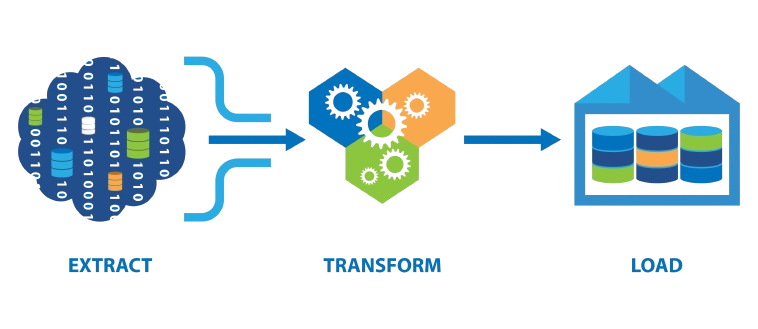
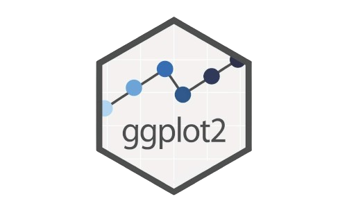

### Sobre mim

<br>

::: fragment
- Graduando de Ciências Sociais
:::

<br>

::: fragment
- [Laboratório de Humanidades Digitais](https://labhdufba.github.io/)
:::

<br>

::: fragment
- [Leonardo Fernandes Nascimento](https://github.com/leofn/)
:::

------------------------------------------------------------------------

### Objetivos

<br>

::: fragment
- Definições
::: 

::: fragment
-   Breve contextualização da pesquisa
:::

<br>

::: fragment
-   Discutir o plano de trabalho tendo o *método* como guia
:::

------------------------------------------------------------------------

### Definições

::: fragment
- Desinformação
:::

::: fragment
> DEFINIÇÃO
:::

<br>

::: fragment
- Extrema-direita
:::

:::
> DEFINIÇÃO
:::

<br>

::: fragment
- Violência política
:::

::: fragment
>Violência política
:::

------------------------------------------------------------------------

### Resumo da pesquisa

<br>

::: fragment
-   Surgimento
:::

<br>

::: fragment
-   Objetivo principal: compreender o papel do telegram no compartilhamento de desinformação em grupos de extrema-direita no Brasil
:::

------------------------------------------------------------------------

#### Teoria fundamentada

<p class="p-px">

::: fragment

[](https://www.google.com/url?sa=i&url=https%3A%2F%2Fwww.amazon.com.br%2FDiscovery-Grounded-Theory-Strategies-Qualitative%2Fdp%2F0202302601&psig=AOvVaw3RNIX2_aM_MHKtIuu_rjjX&ust=1726090069915000&source=images&cd=vfe&opi=89978449&ved=0CBcQjhxqFwoTCLDZoN6ouYgDFQAAAAAdAAAAABAJ)

[](https://medium.com/creditas-tech/o-que-%C3%A9-grounded-theory-e-como-aplicar-em-ux-research-f4c405a6d54a)
:::

</p>

::: fragment
-   Desenvolver a análise teórica *a partir* dos dados observados.
:::

------------------------------------------------------------------------


<div style="display: flex; justify-content: center; align-items: center; height: 100vh; text-align: center;">
  <h3>Métodos na "primeira fase"</h3>
</div>

---

#### Análise Quantitativa: Linguagem `R`

[](https://banner2.cleanpng.com/20181126/abl/kisspng-scalable-vector-graphics-cran-statgraphics-rnn-vitor-c-5bfbd66c032b81.781736061543231084013.jpg)

::: fragment
-   `R` é uma linguagem de programação voltada à análise estatística e visualização de gráficos
:::

::: fragment
- Mineração de dados

> A mineração de dados é o estudo da coleta, limpeza, processamento, análise e obtenção de insights úteis a partir dos dados. (AGGARWAL, Charu C. Data Mining. Springer, 2015, p. 1)

:::

------------------------------------------------------------------------

<h5 style="text-align: center; display: none;">ETL</h5><br>

<div style="text-align: center;">
  <a href="https://www.datachannel.co/blogs/what-is-etl-and-how-the-etl-process-works">

  </a>
</div>


------------------------------------------------------------------------

<h5 style="text-align: center">Visualização com R</h5><br>

<div id="to-flex" style="display: flex; justify-content: center; align-items: center; gap: 10px;">

  <a href="https://www.nicolaromano.net/data-thoughts/plotting-with-ggplot/">
    
  </a>

  <a href="https://www.worldbank.org/en/events/2021/04/28/-r-shiny-days">
    
  </a>

</div>

---

<h6 style="display: none;">Exemplo ggplot2</h6><br>

![]

------------------------------------------------------------------------

<h4 style="text-align: center;">Análise Qualitativa</h4>

<br>

<div style="display: flex; justify-content: center; align-items: center;">
  
</div>


------------------------------------------------------------------------

- O que é o Atlas.ti?

::: fragment
Análise qualitativa de dados auxiliado por computador (*Computer Assisted Qualitative Data Analisys Software*).
:::

::: fragment
-   Principais recursos: *Codes, Families e Networks*
:::

------------------------------------------------------------------------

<div style="display: flex; justify-content: center; align-items: center; height: 100vh; text-align: center;">
  <h3>"Segunda Fase": um salto metodológico</h3>
</div>

---

#### Particularidades do Objeto

<br>

::: fragment
- "Apagões" frequentes
:::

<br>


::: fragment
- Nascimento e morte de grupos e canais
:::

<br>


::: fragment
- Limitações do `R` e `Atlas.ti`
:::

------------------------------------------------------------------------

<h4 style="display: none;">Exemplo R</h4>

<div style="text-align: center;">

<br>

```{r}
ggplot(top10_grupos) +
  geom_bar(aes(x = docCount, y = reorder(keyName, docCount)), fill = "#6092C0", stat = "identity") +
  geom_text(aes(label = number_format(decimal.mark = ",", big.mark = ".")(docCount), x = docCount, y = reorder(keyName, docCount)), position = position_stack(vjust = 0.8), size = 3, color = "black") +
  scale_y_discrete(expand = c(0.06, 0.06)) +
  scale_x_continuous(expand = expansion(c(0, 0.05)), labels = number_format(decimal.mark = ",", big.mark = ".")) +
  labs(y = "Grupos", x = NULL, title = NULL) +
  theme_classic() +
  theme(panel.grid.minor = element_line(linetype = "dashed"), 
        panel.grid.major = element_line(linetype = "dashed"), 
        axis.line.x = element_line(color = "#efefef", linewidth = 0.8), 
        axis.line.y = element_line(color = "#efefef", linewidth = 0.8), 
        axis.text.y = element_text(size = 8), 
        axis.ticks = element_blank(), 
        axis.text.x = element_text(angle = 45, hjust = 1),
        panel.background = element_blank())
```

</div>

---

<h4 style="display: none;">Exemplo Atlas.ti</h4>

<div style="text-align: center;">

  

</div>
---

### `ElasticSearch` & `Kibana`

<br>

::: fragment
-   Melhoria no ETL em tempo real
:::

<br>


::: fragment
-   Visualização otimizada
:::

<br>


::: fragment
-   Análise qualitativa otimizada
:::

---

<h4 style="display: none;">Exemplo Visualização</h4>

[](https://www.elastic.co/pt/kibana/kibana-dashboard)

---

<h4 style="display: none;">Exemplo Análise</h4>

<a href="https://medium.com/databites/whats-behind-elasticsearch-unlocking-the-power-of-data-visualization-23001ecfc4a2" target="_blank">
  
</a>

------------------------------------------------------------------------

### Contribuições da pesquisa

::: fragment
- [Relatório sobre desinformação e teorias da conspiração relacionadas à vacinação em grupos e canais extremistas do Telegram](https://drive.google.com/file/d/1OWrhQFYah651cyMC0IfQ-Wgrc8I06xH2/view?usp=sharing)
::: 

::: fragment
- ["Intankáveis contra o Bostil”: racismo, misoginia e antisemitismo em chats do Telegram (2020-2023)](https://cgi.br/media/docs/publicacoes/1/20240522075208/4-coletanea-artigos-tic-governanca-genero-raca-diversidade.pdf) 
:::

::: fragment
- [Métodos mistos para a antropologia digital: um relato de experiência sobre a análise de grupos bolsonaristas na plataforma Telegram](https://doi.org/10.1590/1806-9983e680407)
:::

---

<h2 class="final">Referências</h2>

<br>

<div style="text-align: center;">
  
<br><br><br>
Acesse o Qr Code ou [clique aqui!](referencias.html)
</div>

------------------------------------------------------------------------

## Obrigado pela atenção!

<br>

<div style="text-align: center; margin-bottom: 40px;">
  <a href="https://giphy.com/portadosfundos/reacoes/tchau">
    
  </a>
</div>

<div style="display: flex; justify-content: center; align-items: center; gap: 50px;">

  <!-- Ícone do Gmail -->
  <a href="mailto:ruan.lima@ufba.br" target="_blank">
    
  </a>

  <!-- Ícone do GitHub -->
  <a href="https://github.com/tutzlima" target="_blank">
    
  </a>
</div>
