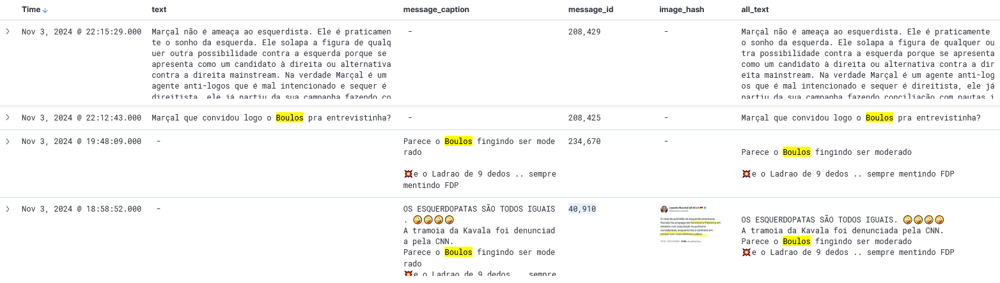

------------------------------------------------------------------------

# Introdução

Como demonstrei na apresentação, a linguagem `R` nos permite analisar os dados e verificarmos suas características, bem como extrair, transformar e armazenar dados retirados de páginas da web, via `web scraping`, por exemplo.  Além disso, o `ElasticSearch` se faz uma ferramenta valiosa de análise qualitativa de dados, como expus brevemente.

Portanto, o documento em questão pretende aprofundar os recursos e aplicabicabilidades dessas ferramentas numa pesquisa em ciências sociais computacionais.

# Guilherme Boulos em `chats` de extrema-direita do Telegram

A escolha de Boulos não surge de grandes questionamentos, considerei apenas que a temática de exemplo deve ser atual e de destaque na política brasileira. Assim, as eleições municipais de 2024 se apresentam como tema bastante relevante, visto o destaque das eleições de São Paulo - destaque que se deu tanto de forma *memética* [^1] quanto em discussões acirradas no campo da esquerda quanto o rumo da cidade em caso a reeleição de Ricardo Nunes (PARTIDO) ou, mais problemático ainda, o avanço de Pablo Marçal (PARTIDO) e seus impactos no *modus operandi* da política brasileira, no *fazer político* em nossos tempos digitais [^2].

[^1]: O QUE É MEME E MEMÉTICA?

[^2]: Obviamente, isso não se limita a Pablo Marçal, mas a extrema-direita de forma geral.: não tenho a pretensão de determinar a prevalência de *um* aspecto da realidade na mudança do "fazer político" em nossos tempos. Apesar da relevância das redes sociais, isso não deve ser apartado de uma materialidade. O avanço da extrema-direita 

Então, tão válido quanto a análise de Boulos nesses `chats`, poderíamos analisar o que foi dito a respeito de Marçal nas eleições municipais, esqueci o que ia dizer depois disso, kek.

## Critérios de busca

1. A nossa expressão de busca (**query:**) foi `all_text: "guilherme boulos" or boulos`

Por padrão, a *sintaxe* de busca do `ElasticSearch` espera uma estrutura próxima da seguinte:

|VARIÁVEL|`:`|TERMO(S)|
|:---:|:---:|

No caso, `all_text` é uma variável da base de dados que recolhe todo tipo de texto contido nas mensagens, como textos "comuns", isolados, quanto legendas, textos que acompanham outro conteúdo contido nas mensagens (como mensagens com imagens). Por exemplo:

Como pode-se observar, as variáveis selecionadas a serem **exibidas** em `data explore` foram `text` (texto isolado), `message_caption` (legendas), `message_id` e `image_hash` a fim de identificarmos as mensagens e imagens. 

Se observarmos, tanto `message_id 234,670` e `message_id 40,910` são legendas, mas apenas a última é legenda [*de uma imagem*](https://telegram.metodosdigitais.org/media/a1ff81ff95bf2db77a00fe01ff00d4005acacb4035dddb4a028ab4216d067eb3.jpg). De qualquer forma, o ponte é demonstrar que `all_text` expõe tanto `text` quanto `message_caption`, tanto `message_id 208,429` quanto `message_id 40,910`.

1. Período: Set 9, 2023, 00:00h & Nov 3, 2024 23:59h

O tempo selecionado abrange tanto uma semana antes quanto uma semana depois das eleições municipais de 2024, realizadas entre o dia 6 de outubro (1º turno) e 27 de outubro (2º turno).
